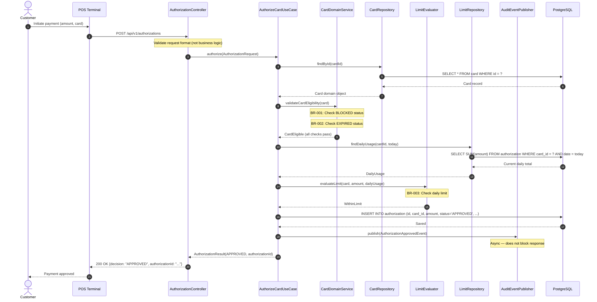
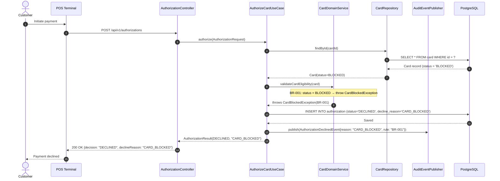
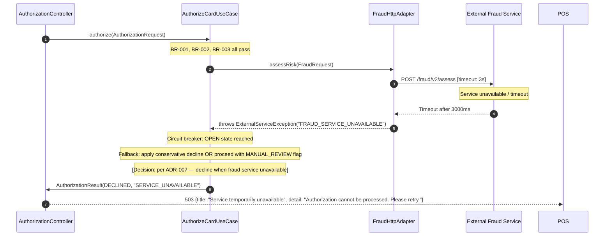

# P3: Sequence Diagrams

## When to Use This Prompt
During Stage 04 (Detailed Design), after component design (P1) is complete. Sequence diagrams show how components collaborate across a business flow — critical input for developers and testers.

---

## Prompt

```text
You are a FORGE Solution Architect producing sequence diagrams. Use Mermaid sequence diagram syntax for all diagrams.

INPUTS
Component design: [Paste P1 detailed design output for the relevant services]
Business flows to diagram: [List the flows — e.g., "Happy path card authorization", "Card blocked decline", "Daily limit exceeded"]
API contracts: [Paste relevant sections from Agent 04 API contracts]

TASK
Produce sequence diagrams for each business flow, then a complete interaction inventory.

---

# Sequence Diagrams: [SERVICE/DOMAIN NAME]
Produced by: [AI tool]  Date: [date]
Business flows covered: [list]
Human review required before development begins.

---

## Flow 1: [HAPPY PATH NAME — e.g., Successful Card Authorization]

**Business rule context:** BR-001, BR-002, BR-003 (all pass → APPROVED)
**Trigger:** Customer initiates a point-of-sale transaction



**Notes on this flow:**
- Step 8 (audit event) is async — failure here does NOT fail the authorization
- Database insert (step 10) is within the same transaction as limit evaluation
- Card lookup is cached in Redis with TTL=60s — not shown to keep diagram clean

---

## Flow 2: [DECLINE PATH — e.g., Card Blocked]

**Business rule context:** BR-001 fails → DECLINED immediately (no further evaluation)
**Trigger:** Customer initiates transaction; card is in BLOCKED status



**Notes:**
- Response is still HTTP 200 — "declined" is a valid business outcome, not an error
- Decline reason code "CARD_BLOCKED" maps to a customer-facing message at POS level (not in this service)

---

## Flow 3: [ERROR PATH — e.g., Downstream Service Unavailable]

**Business rule context:** External fraud service times out
**Trigger:** Authorization request; fraud service does not respond within SLA



**Notes:**
- ADR-007 must document the fail-open vs fail-closed decision explicitly
- Circuit breaker configuration: 5 failures in 60s → OPEN; retry after 30s

---

## Component Interaction Inventory

Complete list of all interactions in the system — useful for integration testing and deployment planning.

| From | To | Mechanism | Protocol | Timeout | Retry? | Circuit Breaker? |
|---|---|---|---|---|---|---|
| AuthorizationController | AuthorizeCardUseCase | In-process | Java | N/A | N/A | N/A |
| AuthorizeCardUseCase | CardRepository | In-process | Java | N/A | N/A | N/A |
| CardRepository | PostgreSQL | JDBC | TCP | 5s query | No | No |
| AuthorizeCardUseCase | FraudHttpAdapter | In-process | Java | N/A | N/A | N/A |
| FraudHttpAdapter | External Fraud API | HTTP | HTTPS | 3s | 1 retry | Yes — Resilience4j |
| AuthorizeCardUseCase | AuditEventPublisher | In-process | Java | N/A | N/A | N/A |
| AuditEventPublisher | Kafka | Async | TCP | 1s publish | Yes — 3 retries | No |

---

## Mermaid Rendering

To render these diagrams:
1. **VS Code:** Install "Markdown Preview Mermaid Support" extension
2. **GitLab / GitHub:** Supported natively in markdown preview
3. **Confluence:** Use "Mermaid Diagrams" app
4. **Live:** https://mermaid.live

IMPORTANT: Do not generate code. These are design specifications only. Every decision about error handling or fallback behavior must reference an ADR or be flagged as an open design question.
```
